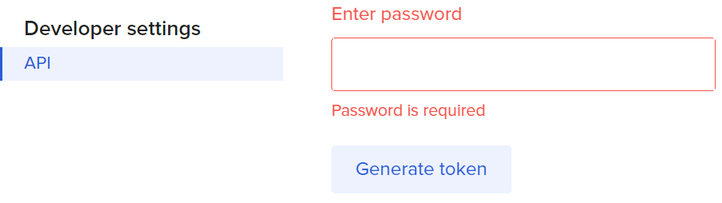

# Обрезка ссылок с помощью Битли

Скрипт позволяет получить короткую ссылку на вводимый пользователем сайт.
Если пользователь введёт уже короткую ссылку, то покажется количество переходов по ней.
Если введена неправильная ссылка, то скрипт выведет соответствующую ссылку.

### Как установить

Чтобы программа работала корректно, нужно сгенерировать ключ на сайте app.bitly.com.
Сначала нужно зарегистрироваться на этом сайте. Затем в профиле получить ключ API, введя свой пароль от учётной записи
и нажав кнопку "Generate token".



Ключ выглядит как набор из символов английского алфавита и цифр. Этот ключ следует записать в файл .env в следующем виде.

```
BITLY_TOKEN=Ваш сгенерированный ключ
```

Python3 должен быть уже установлен. 
Затем используйте `pip` (или `pip3`, есть конфликт с Python2) для установки зависимостей:
```
pip install -r requirements.txt
```

### Цель проекта

Код написан в образовательных целях на онлайн-курсе для веб-разработчиков [dvmn.org](https://dvmn.org/).
